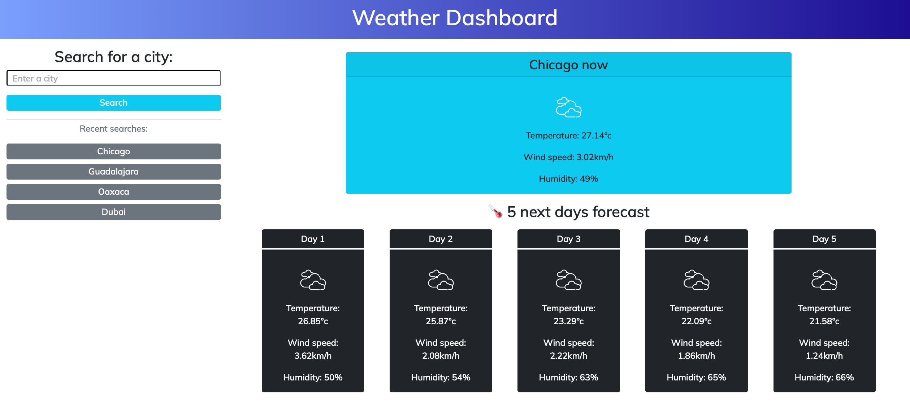

# WorkSchedule - jQuery
On this challenge im working from an empty file creating each element, the html, the css and the js. Using the 5-day weather API.

## Functionality

When enter the page for the first time you'll notice there's no current searches. In order to store your data you must search for a city. If the city doesnt exist it will show you on the main container "city not found", and if you didnt put any text value it may throw you an alert.
When searching for a real city it will display the current day (blue container) and the next 5 days (black container), with information about humidity, temperature and wind speed, you can search as many cities as you want but the localstorage will only retrieve the last 4. You may be seeing your last data even when reload the page. 

## User Story

AS A traveler
I WANT to see the weather outlook for multiple cities
SO THAT I can plan a trip accordingly

## Acceptance Criteria

GIVEN a weather dashboard with form inputs
WHEN I search for a city
THEN I am presented with current and future conditions for that city and that city is added to the search history
WHEN I view current weather conditions for that city
THEN I am presented with the city name, the date, an icon representation of weather conditions, the temperature, the humidity, and the wind speed
WHEN I view future weather conditions for that city
THEN I am presented with a 5-day forecast that displays the date, an icon representation of weather conditions, the temperature, the wind speed, and the humidity
WHEN I click on a city in the search history
THEN I am again presented with current and future conditions for that city

##Page SS

##Deployed Webpage
https://jonathanlunabiom.github.io/WeatherForecast/
